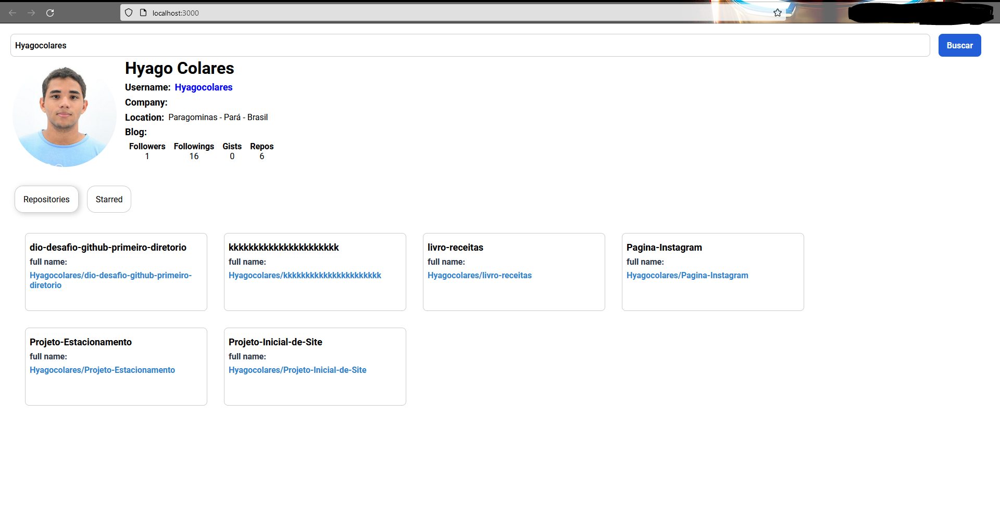

# Começando a criar React App

## Sobre o projeto

Este repositório foi criado para mostrar um aplicativo frontend com componentes reutilizáveis. Um aplicativo usando a api pública do github.

### Características

- Pesquise informações pelo: username
- Pesquise repositório pelo username
- Pesquisa favoritado pelo: username

### Visualizar

Impressão do projeto acabado.

### Bibliotecas usadas

- [axios](https://www.npmjs.com/package/axios)
- [react-tabs](https://www.npmjs.com/package/react-tabs)
- [styled-components](https://styled-components.com/)
